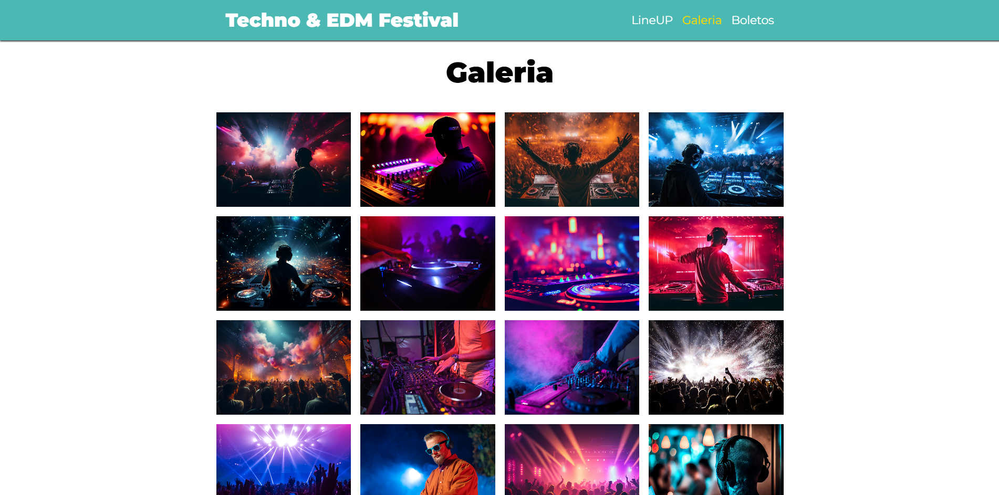

# Techno & EDM Festival 🎵



Landing page interactiva y moderna para un festival de música electrónica, desarrollada con **HTML5**, **SCSS (Sass)**, **JavaScript** y herramientas de automatización con **Node.js** y **Gulp**.

---

## 🚀 Descripción

Proyecto web responsive para un festival de Techno & EDM en Buenos Aires. Incluye LineUp, galería de imágenes interactiva, y sección de boletos. Todo el código está modularizado para fácil mantenimiento y escalabilidad.

---

## 🛠️ Tecnologías utilizadas

- **HTML5**
- **SCSS (Sass)**
- **JavaScript (Vanilla)**
- **Node.js**  
- **Gulp** (automatización de tareas)
- **Google Fonts** (Montserrat)

---

## ⚡ Instalación y uso

1. **Cloná el repositorio:**
   ```bash
   git clone https://github.com/XxTreendxX/FestivalMusica
   cd tu-repo
   ```

2. **Instalá las dependencias con Node.js:**  
   (Asegurate de tener [Node.js](https://nodejs.org/) instalado)
   ```bash
   npm install
   ```

3. **Levantá el entorno de desarrollo con Gulp:**  
   Esto compilará los archivos SCSS, copiará JS y quedará viendo los cambios en tiempo real.
   ```bash
   npx gulp
   ```
   O, si tenés un script configurado:
   ```bash
   npm run dev
   ```

4. **Abrí el archivo `index.html` en tu navegador.**

---

## 📁 Estructura de carpetas

```
build/
  ├── css/
  │   ├── App.css
  │   └── App.css.map
  └── js/
      └── App.js
src/
  ├── img/
  │   └── gallery/
  │       └── [fotos]
  ├── js/
  │   └── App.js
  └── scss/
      ├── base/
      │   ├── _global.scss
      │   ├── _index.scss
      │   ├── _mixins.scss
      │   ├── _normalize.scss
      │   └── _variables.scss
      ├── layout/
      │   ├── _boletos.scss
      │   ├── _festival.scss
      │   ├── _footer.scss
      │   ├── _galeria.scss
      │   ├── _header.scss
      │   ├── _index.scss
      │   ├── _lineup.scss
      │   └── _video.scss
      └── App.scss
video/
  └── dj.mp4 / dj.webm / dj.ogv
index.html
gulpfile.js
package.json
preview.png
```

---

## 🧩 SCSS modular

- **/base**: Variables, mixins, resets y estilos globales.
- **/layout**: Un archivo por cada gran bloque de la página (header, footer, galería, etc).
- **App.scss**: Archivo principal que importa todos los parciales SCSS.

---

## 🎨 Funcionalidades destacadas

- **Navegación fija** y resaltado dinámico de sección activa al hacer scroll.
- **Scroll suave** en la navegación.
- **Galería de imágenes** con modal interactivo.
- **Página responsive** y animaciones modernas.
- **Automatización de tareas** con Node.js y Gulp (compilación SCSS y JS en tiempo real).

---

## 👨‍💻 Autor

**Rodrigo Otreras**  
[LinkedIn](https://www.linkedin.com/in/rodrigo-nahuel-otreras-703a741a1/) | [GitHub](https://github.com/XxTreendxX)

---

¿Te gustaría colaborar, proponer mejoras o dejar una estrella ⭐? ¡Tu feedback es bienvenido!
